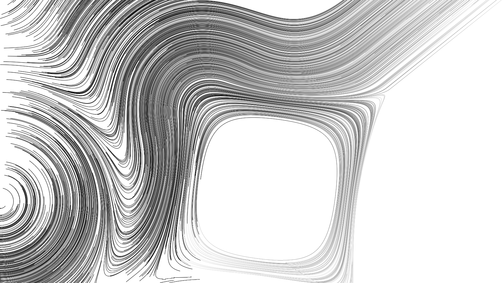

# flow

# what

a command line program that produces high resolution png file with procedural 2d art
note : this is a on-going project, it is not finished. Only tested on my machines.

# how

Based on [flow fields](https://tylerxhobbs.com/essays/2020/flow-fields) and [2d distance fields](https://iquilezles.org/www/articles/distfunctions2d/distfunctions2d.htm)

## anti-aliasing

The disc pattern brush is applied with kind of MSAA, each pixel we check 16 sampling points against the disc brush to compute the oppacity of the pixel. Should be easily implemented with SIMD. Opacity is used to print pixel with alpha blending.

## multithread

Goal is to generate big high quality images (4k and more). Most computation happen on big array and can be splitted :
* array of angle can be computed separetly on multiple thread
* simulating points is independant, can be splitted
* drawing points also can be splitted in different bucket that prevent accessing to the same pixel
