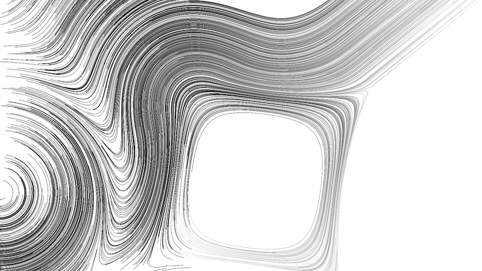

# flow

# what

a command line program that produces high resolution png file with procedural 2d art

note : this is a on-going project, it is not finished. Only tested on my machines.

# how

Based on [flow fields](https://tylerxhobbs.com/essays/2020/flow-fields) and [2d distance fields](https://iquilezles.org/www/articles/distfunctions2d/distfunctions2d.htm)

Signed distance fields are used to create the flow field.

## anti-aliasing

Line/disc/triangle are rasterized with a king of MSAA, for each pixel we compute distance to the primitive for 256 samples positions. This part is written with AVX intrinsic because it's the most expensive functions.

## multithread

Goal is to generate big high quality images (4k and more). Most computation happen on big array and can be splitted :
* array of angle can be computed separetly on multiple thread
* simulating points is independant, can be splitted
* rasterization also can be splitted in different bucket that prevent accessing to the same pixel

Task scheduler used : https://github.com/vurtun/mmx/blob/master/sched.h

## color

Currently using r8g8b8a8 image but the plan is to use linear color in float and write hdr.

Using https://github.com/nothings/stb/blob/master/stb_image_write.h
